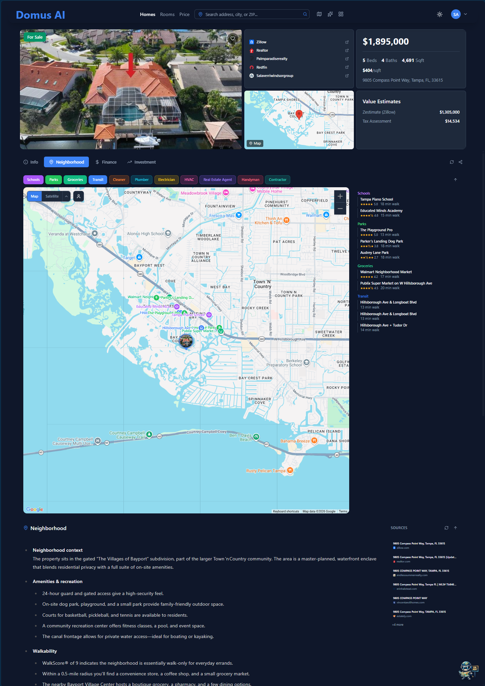
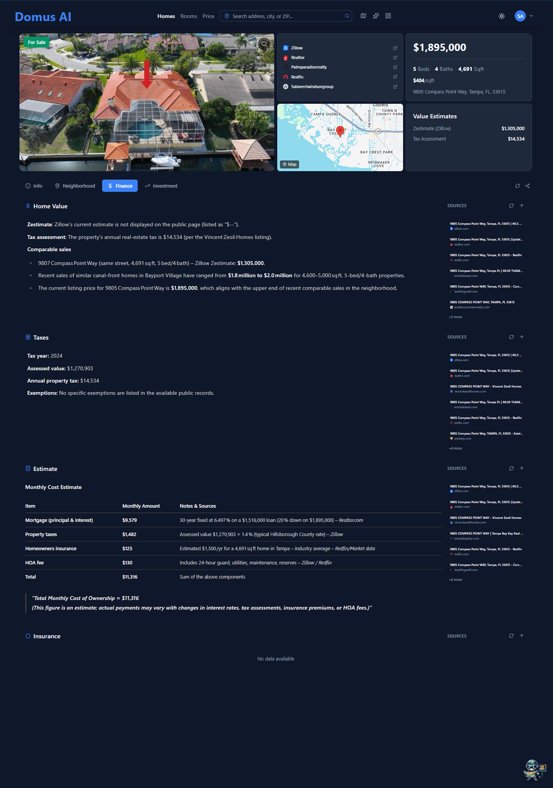
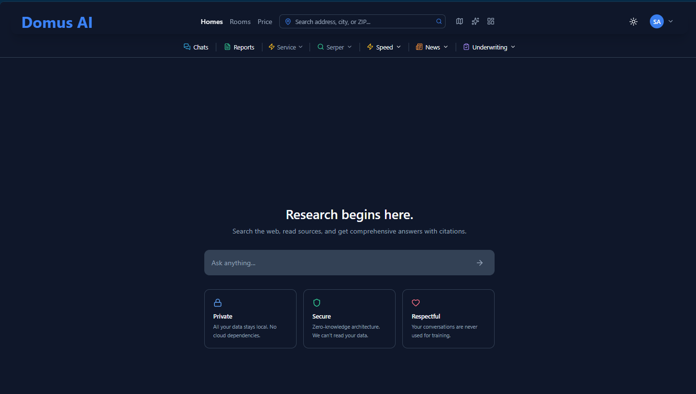
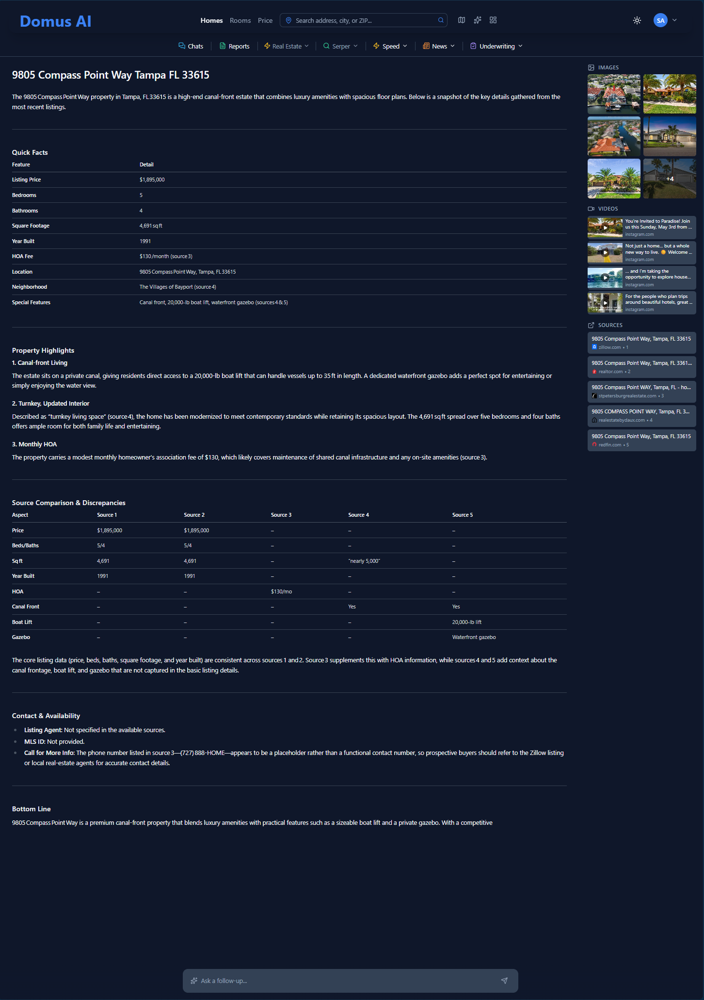
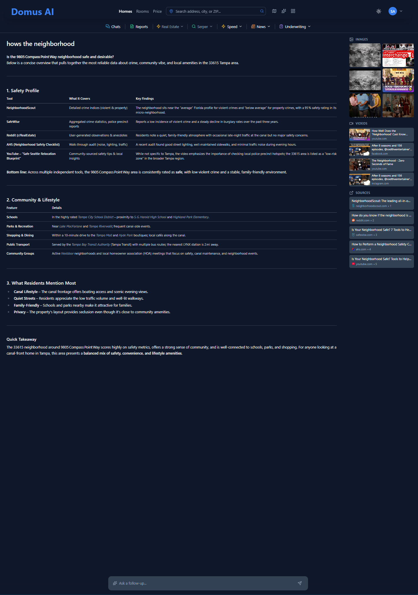
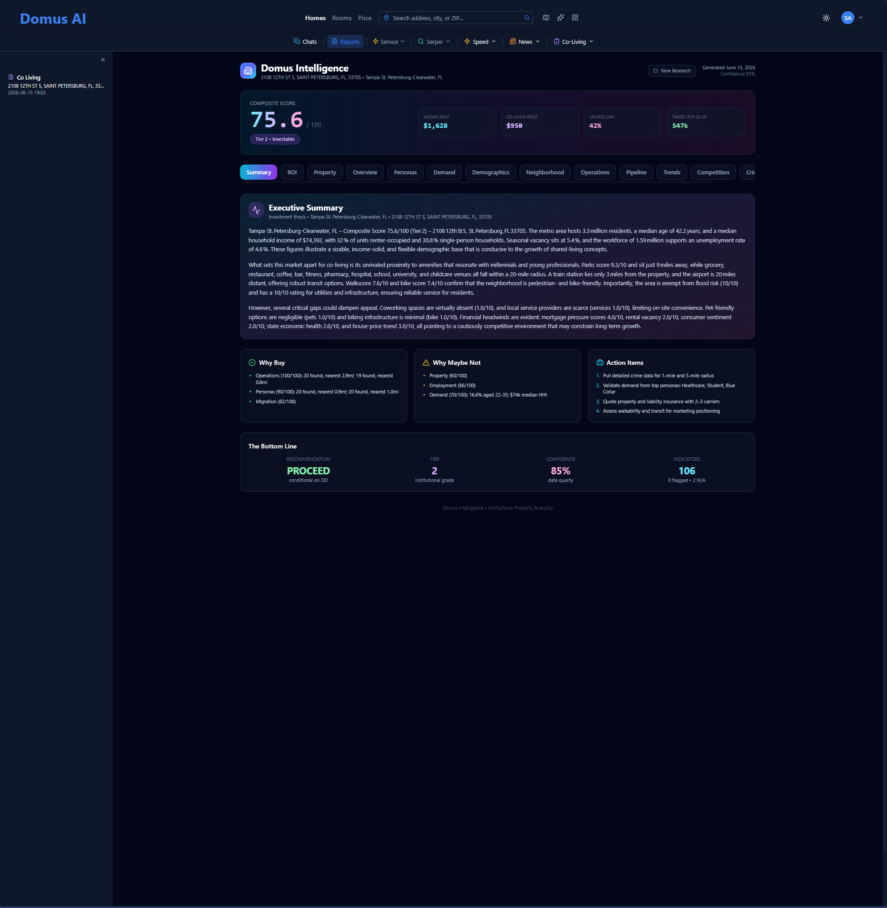
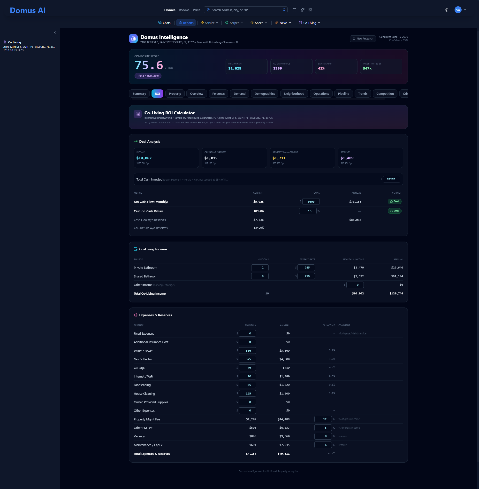
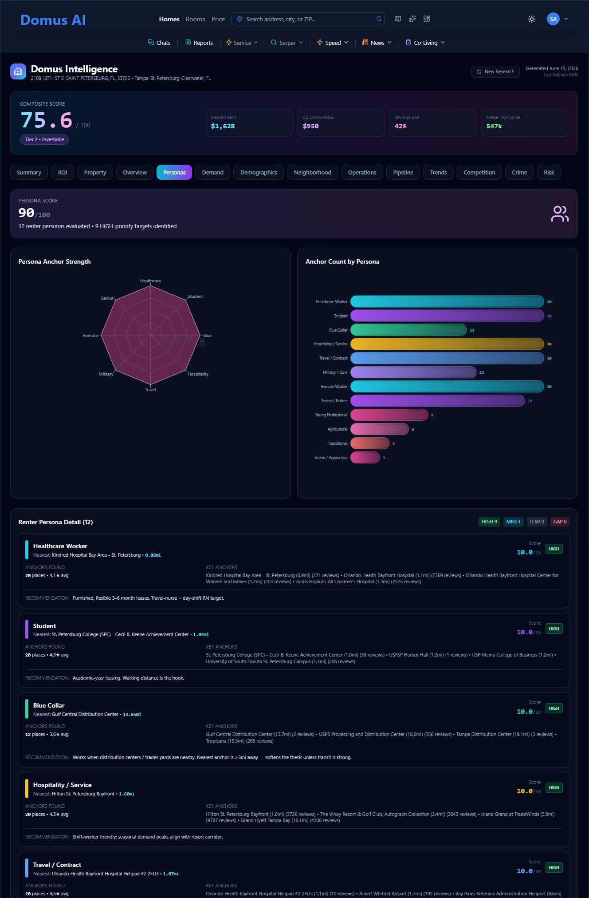
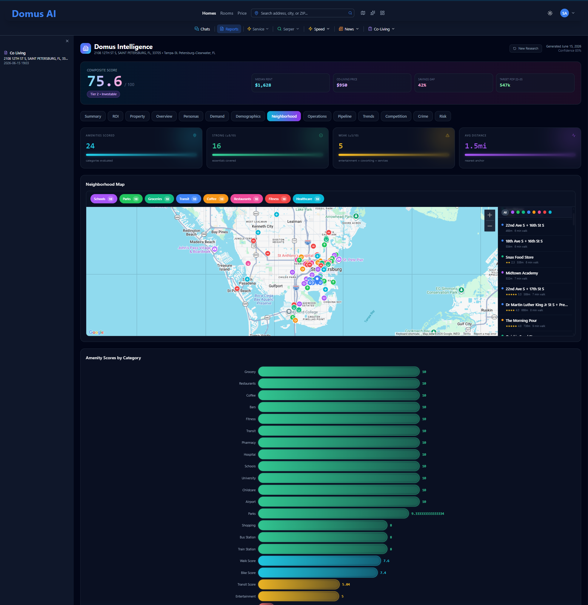

<h1 align="center">
  <a href="https://domusai.ai">
    <picture>
      <source media="(prefers-color-scheme: dark)" srcset=".github/assets/logo.svg">
      
    </picture>
  </a>
</h1>

  <em><b>Domus AI</b> — the AI-powered shared housing marketplace where listing a room is as easy as posting a photo and finding one is as fast as asking a question. 
  Just <b>move in</b>.</em>

  <b>Weekly payments. 1-day approval. AI that actually helps.</b>
  

---

<h2 align="center">Why Domus AI?</h2>

Shared housing is broken. Craigslist is a minefield. Facebook groups are chaos. Traditional rental platforms charge monthly rent that locks people in and shuts people out. Finding a compatible roommate shouldn't require a spreadsheet and a prayer.

<b>Domus AI fixes this.</b> An AI-powered marketplace where hosts list rooms in minutes, tenants find matches through natural conversation, and everyone pays weekly instead of drowning in first-month-last-month-deposit math.

<b>Everything just works.</b> You sign up, and Atlas — your AI assistant — handles the rest, from property intelligence to encrypted vault storage for your private data.

---

  

Six steps. That's it.

| Step | What You Do | What Domus Does |
|:---:|:---:|:---:|
| **1. Address** | Type your address | Autocomplete from 154M+ US addresses, auto-fill location data |
| **2. Type** | Pick property type | Pre-configured options, ready to go |
| **3. Occupancy** | Owner-occupied? One tap | Adjusts listing presentation automatically |
| **4. Photos** | Upload images | Handles resizing, thumbnails, and gallery layout |
| **5. Timeline** | Set availability | Calendar picker with smart defaults |
| **6. Pricing** | Set weekly rate | Done. Your room is live. |

<b>Auto-save everything</b> — walk away mid-step, come back tomorrow, pick up where you left off 
<b>Progress tracking</b> — a visual progress bar shows exactly where you are 
<b>Save &amp; exit</b> — close the browser, your draft is waiting when you return 
<b>One-click publish</b> — finalize and your listing is instantly live

Hosts don't need to learn a platform. They need to list a room. That's it. That's the product.

---

  

Two ways to search. Both feel effortless.

<h3 align="center">AI-Powered Search</h3>

Just ask Atlas. <em>"I need a furnished room near downtown Tampa under $250 a week"</em> — he understands location, budget, amenities, and preferences. No dropdowns. No filter menus. Just a conversation with your AI assistant.

<h3 align="center">Map-Based Search</h3>

Interactive map with real-time property overlays. Drag, zoom, explore. Filter by price, beds, baths, property type. Quick links to popular cities. Click a pin, see the listing. Every search result enriched with neighborhood intelligence automatically.

<b>11.2M+ searchable properties</b> across Florida and expanding. Autocomplete across <b>154M+ US addresses</b>. It's fast.

---

  

  

Every property page comes with <b>Atlas</b> — your personal AI assistant. He knows the property, the neighborhood, and the surrounding area. Atlas is just there, ready to help.

<h3 align="center">What Atlas Knows</h3>

| Intelligence | Details |
|:---:|:---:|
| **Schools & Safety** | Nearby schools with ratings, demographics, crime statistics |
| **Nearby Places** | Restaurants, shops, gyms, transit, and more |
| **Air Quality** | Real-time AQI monitoring |
| **Transit** | Public transportation access and routes |
| **Property Details** | Auto-enriched from web sources when data is missing |
| **Comparables** | Similar properties for price comparison |
| **Tax & Insurance** | Property tax history and insurance estimates |
| **Market Research** | AI-generated summaries with source citations |

<h3 align="center">How It Works</h3>

Ask Atlas anything about a property. <em>"Are there good schools nearby?"</em> <em>"What's the commute to downtown?"</em> <em>"Is this neighborhood safe?"</em> He pulls from multiple data sources, synthesizes an answer, and cites every source. If property data is missing or stale, Atlas automatically enriches it from the web.

<h3 align="center">Every Listing, Investigated</h3>

Open any listing and Atlas has already done the homework. Pulling from <b>every major source — Zillow, Realtor, Redfin, and more</b> — he synthesizes the whole property into four tabs, each with a live <b>Sources rail</b>. Nothing is invented; every fact links back to where it came from.

| Tab | What Atlas builds |
|:---:|:---:|
| **Info** | Facts and features, reconciled across 8+ listing sources |
| **Neighborhood** | Schools, parks, groceries, transit — and the nearest plumber, electrician, and HVAC tech — mapped, ranked, with walk times |
| **Finance** | Value, comps, taxes, and a full monthly cost-of-ownership build |
| **Investment** | Rent potential, appreciation, risks, opportunities — and a plain-English bottom-line call |

<b>Need a plumber? Atlas already found one.</b> Every amenity and trade around the property, on a live map with a ranked nearby list — not a static rating.

  

<b>The real cost of owning it.</b> Mortgage, taxes, insurance, HOA — built into a monthly cost-of-ownership breakdown, every line cited to its source.

  

---

  

Atlas isn't a chatbot bolted on as an afterthought. He's woven into every layer of the platform.

<h3 align="center">Multi-Model Chat</h3>

Talk to <b>Claude, GPT, Gemini, Grok</b>, or a <b>local model</b>. Switch providers mid-conversation. Every response streams in real-time — no waiting for a spinner to finish. Full conversation history, encrypted in your vault.

<h3 align="center">Deep Research Mode</h3>

Need to go deeper? Ask Atlas to research. He runs a full investigation with web search, source scraping, and citation tracking. Every claim traced to its source. Follow-up questions generated automatically to keep the research flowing.

  

Ask a real question, get a real report. Atlas reads the sources, reconciles where they disagree, and hands you a structured answer — citations on every claim, and a bottom line at the end.

  

  

---

  

  <b>106 data points. Atlas tells you the four that matter.</b>

Type an address. Get the analysis a real estate analyst would charge you thousands for — except you don't have to read it. <b>Free, on any listing.</b>

Domus pulls everything: crime, comps, demographics, the development pipeline, every vendor within miles, five years of rent and price trends. Then it does the part that actually matters — it filters out the noise and tells you what could <em>kill</em> the deal. Is crime a problem here? You'll only hear about it if it is. Is the nearest plumber 40 minutes away? You'll find out before you buy, not after the pipe bursts.

Every report opens with the verdict — a composite score, an investment tier, and a plain-English <b>Why Buy / Why Maybe Not</b> — backed by 106 indicators across 14 dimensions. The depth is there when you want to dig. You just don't have to.

<h3 align="center">One report. 14 dimensions.</h3>

| Module | What you get |
|:---:|:---:|
| **Executive Summary** | Investment thesis, Why Buy / Why Not, action items — and a bottom-line **PROCEED / hold** call with a confidence level |
| **ROI Underwriting** | Live co-living deal model — rooms, rates, every expense line, reserves, monthly cash flow, cash-on-cash, verdict |
| **Overview** | Weighted gate scoring across every dimension, ranked strengths and risks |
| **Property** | Beds, baths, sqft, site conditions, tax history, valuation estimates, key takeaways |
| **Personas** | A dozen renter personas scored against the real anchors nearby — hospitals, campuses, employers |
| **Demand** | Target-population sizing, demand-profile radar, age-band distribution |
| **Demographics** | Household income distribution, housing stock mix, commute modes |
| **Neighborhood** | 24 amenity categories, mapped, with walk and category scores |
| **Operations** | A 32-category local vendor ecosystem — repair, cleaning, inspection, turnover |
| **Pipeline** | Active construction, coming-soon supply, and leasing activity nearby |
| **Trends** | 5-year rent / income / home-value CAGR |
| **Competition** | Active operators, bed supply, price-per-bed, market share |
| **Crime** | Crime index, violent and property rates, victimization odds |
| **Risk** | Flood zone, insurance, and a weighted risk gate |

<h3 align="center">See it</h3>

<b>The verdict first.</b> The top of every report is the decision, not the data — composite score, tier, confidence, and a clear call, with the three things working in the deal's favor and the three that give pause.

  

<b>Underwrite a co-living deal in real time.</b> Rooms, rates, every expense and reserve — cash flow and cash-on-cash recalculated as you type, built for co-living instead of a single tenant.

  

<b>Demand you can see.</b> A dozen renter personas scored against the real anchors around the property — the workers, students, and travelers who'd actually fill the rooms.

  

<b>The whole neighborhood, scored.</b> Every amenity that matters for shared living — found, mapped, and scored, with walk and bike scores and the distance to the nearest anchor.

  

<em>…plus Property, Overview, Demand, Demographics, Operations, Pipeline, Trends, Competition, Crime, and Risk — 14 dimensions in every report.</em>

<h3 align="center">Why this isn't just another listing</h3>

Marketplaces show you the room. Calculators model the math. Neither reads the whole picture and hands you the call. Craigslist won't tell you if the deal makes money. PadSplit won't hand you a scoring model. Domus does both — co-living-native underwriting <em>and</em> a working marketplace — then boils it down to the four things that matter.

<b>Domus gives you the complete picture, then boils it down.</b> 
<em>The details are there if you want them. You just won't have to go looking.</em>

---

  

The entire rental lifecycle — from discovery to payment — in one platform. No external tools. No spreadsheet tracking. No chasing checks.

<h3 align="center">For Tenants</h3>

  <code>Search&nbsp; →&nbsp; Apply&nbsp; →&nbsp; Get Approved&nbsp; →&nbsp; Sign Lease&nbsp; →&nbsp; Pay Weekly&nbsp; →&nbsp; Build Credit</code>

<b>Weekly payments</b> — no massive upfront deposits, no first-and-last 
<b>1-day approval target</b> — fast enough for urgent housing needs 
<b>All-inclusive pricing</b> — utilities, WiFi, furniture bundled in the weekly rate 
<b>Flexible terms</b> — 12-week minimums, not 12-month leases 
<b>Credit building</b> — on-time weekly payments reported to build your score 
<b>Verified hosts</b> — background checks and income verification on all members

<h3 align="center">For Hosts</h3>

  <code>List Room&nbsp; →&nbsp; Review Applications&nbsp; →&nbsp; Approve&nbsp; →&nbsp; Collect Payments&nbsp; →&nbsp; Track Earnings</code>

<b>2-minute listing</b> — the wizard handles everything 
<b>Application management</b> — review, approve, decline with notes 
<b>Automatic payment collection</b> — weekly, handled for you 
<b>Earnings dashboard</b> — track income, view payment history, download reports 
<b>Member management</b> — verified tenants with background checks 
<b>Direct messaging</b> — talk to applicants and tenants without leaving the platform

<h3 align="center">Dashboard</h3>

Hosts and tenants each get a tailored dashboard. Hosts see earnings, active listings, pending applications, and member status. Tenants see payment history, application status, saved properties, and AI conversation history. Everything in one place.

---

  

Your data is encrypted before it leaves your browser. The server stores ciphertext. We can't read it. Nobody can.

| Layer | What It Means For You |
|:---:|:---:|
| **Zero-Knowledge Vault** | Your data is encrypted with your password — we never see it |
| **Encrypted Storage** | Favorites, saved searches, preferences, AI conversations — all encrypted |
| **Recovery Key** | Lose your password, not your data — recovery key restores access |
| **Secure Authentication** | Google sign-in supported, with automatic session management |
| **Role-Based Access** | Granular permissions — member, host, admin |
| **Price Alerts** | Saved properties trigger encrypted notifications on price or status changes |

No "trust us with your data." <b>Verify that we can't touch it.</b>

---

<h2 align="center">Who Is This For?</h2>

<b>Room seekers</b> who want to find affordable, flexible housing without signing their life away on a 12-month lease 
<b>Hosts</b> who have a spare room and want to earn income without becoming a property management company 
<b>Operators &amp; serious hosts</b> who want to underwrite a co-living deal — score it, model the ROI, see the demand — before they ever buy 
<b>Anyone</b> tired of Craigslist scams, Facebook group chaos, and platforms that charge monthly rent plus deposits plus fees 
<b>People who move</b> — digital nomads, traveling professionals, students, anyone who needs housing measured in weeks, not years 
<b>Privacy-conscious users</b> who want zero-knowledge encryption that just works

---

  
    
  <b>Housing should be simple. Now it is.</b>
   
  <em>Just move in.</em>
    
  <a href="https://domusai.ai"><b>domusai.ai</b></a>

